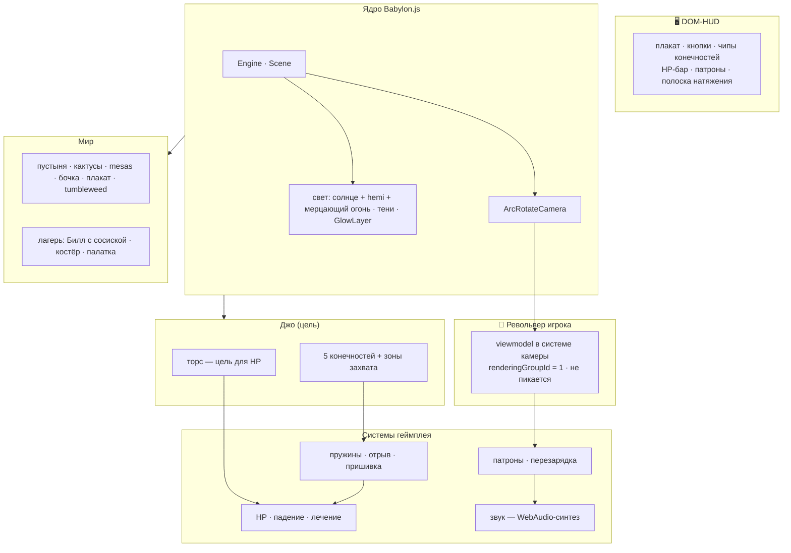
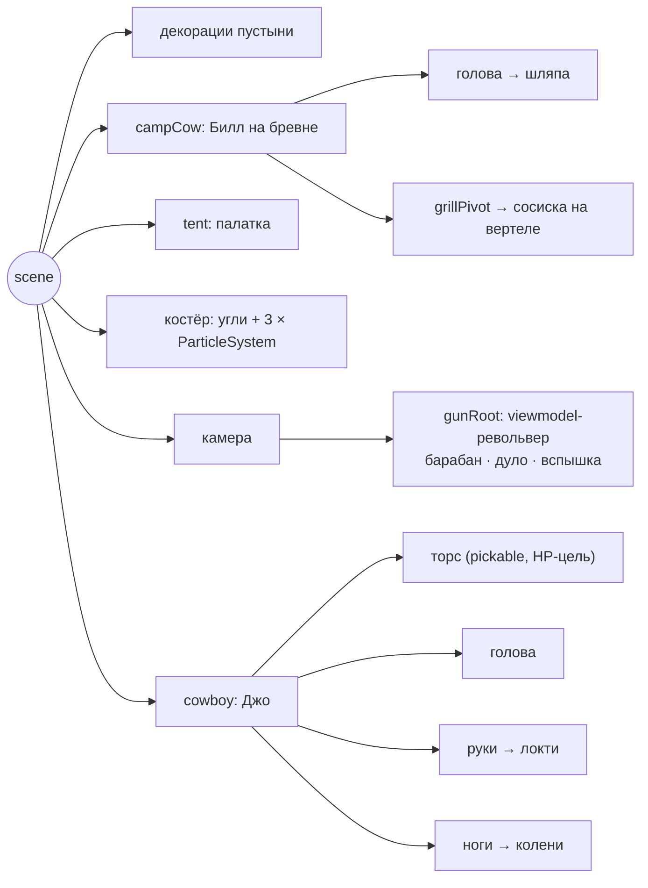
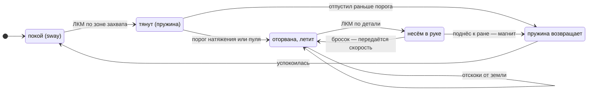
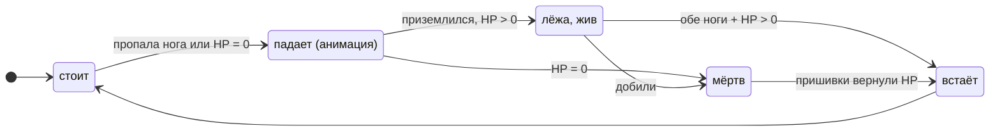
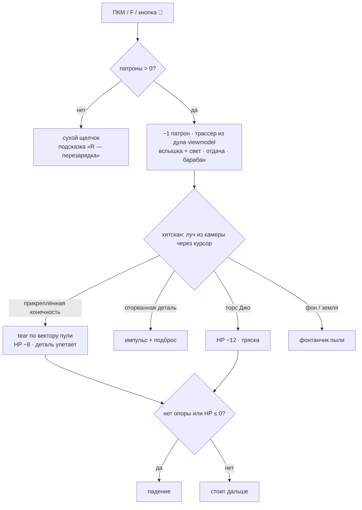

# 🤠 ТЯНИ КОВБОЯ! — интериновая кукла-ковбой

Одностраничная браузерная игра на **Babylon.js**. Главный герой — «резиновый Джо»:
его можно тянуть за конечности (перетянешь — оторвётся), расстреливать из
револьвера, лишать ног и оживлять иглой. На заднем плане живёт лагерь: Билл
в шляпе и трусах в горошек сидит на бревне и жарит сосиску над костром,
рядом раскрытая палатка и tumbleweed.

**Один HTML-файл. Ноль ассетов** — вся геометрия, текстуры, частицы и звук
генерируются кодом при запуске.

---

## 🎮 Управление

| Действие | Ввод |
|---|---|
| Тянуть конечность | **ЛКМ** по кисти / сапогу / голове → вести мышь |
| Отрыв перетягиванием | довести полоску натяжения до красной зоны |
| Выстрел | **ПКМ** / **F** / кнопка 🔫 — в точку курсора |
| Перезарядка | **R** (барабан, 6 патронов) |
| Нести оторванную деталь | ЛКМ по детали → вести |
| Швырнуть деталь | отпустить на быстром движении — передастся скорость |
| Пришить обратно | поднести деталь к ране (магнит) |
| Навести камеру на деталь | клик по «перечёркнутому» чипу внизу |
| Камера | тянуть пустое место; колесо / щипок — зум |

Кнопки HUD: 🔫 Огонь · 🪡 Пришить всё · ↺ Сначала · 🔊 звук.

## ⚔️ Механики

### Растяжение
Каждая конечность — пружинная система: направление задаётся кватернионом
«ось → курсор», длина — расстоянием до курсора (кисть/стопа/шляпа доходят
до него точно). При натяжении конечность сужается (объём ≈ константен),
локоть/колено распрямляются, скрип нарастает. Отпустил раньше порога —
недодемпфированная пружина возвращает с «боянгом».

### Отрыв
По порогу натяжения **или по пуле**. Позиция компенсируется так, чтобы
кончик остался в точке разрыва — деталь не телепортируется к плечу.
Оторванная часть летит **по вектору пули**, отскакивает от земли; на теле
остаётся рана (тёмное кольцо шва + пушок). Тряска камеры, шок на лице,
облачко пуха, синтезированный «хрясь».

### Стрельба
Револьвер — viewmodel у нижнего центра экрана (в системе камеры).
Хитскан: попадание вычисляется мгновенно лучом из камеры через курсор,
трассер из дула — чисто визуал. Отдача, вспышка в дуле + динамический
свет, прокрут барабана, 6 патронов, перезарядка по **R** (~0.9 с, три
щелчка). Пуля по оторванной детали — подброс: частями можно играть в футбол.

### Живучесть Джо

| Источник | Эффект |
|---|---|
| Пуля → торс | −12 HP |
| Отрыв конечности (пулей или тягой) | −8 HP |
| Пришивание любой детали | **+20 HP** |
| Нет хоть одной ноги | падение (независимо от HP) |
| HP = 0 | падение + «мёртв»: не дышит, глаза закрыты, не следит взглядом |

Опрокидывание — анимация (параметр позы `downAmt`, не рэгдолл): все
прикреплённые конечности — дети `cowboy`, падают вместе с телом. Живой
лёжа моргает и водит глазами. Пришил ноги и поднял HP выше нуля — встаёт.
Игровая петля: **расстрелял → зашил → живой**.

### Лагерь
Билл дышит, моргает, вертит головой и держит прутик, на котором вращается
сосиска (вертел вокруг оси прутика); с неё капает жир и изредка «плюёт»
ими в огонь. Костёр: пламя, искры, дым, угли-эмиссия, мерцающий свет.
Палатка: скаты, стойки, пол, два спальника, растяжки с колышками.

## 🛠 Технологии

- **Babylon.js** (CDN, без сборки) — рендер, пикинг, частицы, слои
- **WebAudio** — весь звук синтезируется на лету (скрип, выстрел, отрыв,
  перезарядка, стук падения)
- **Canvas 2D** через `DynamicTexture` — процедурные текстуры: клетка
  рубашки, деним, песок, плакат «WANTED», горошек трусов, спрайт частиц
- Чистый JS, ноль зависимостей в рантайме
- PBR-материалы (metallic/roughness) + окружение environmentSpecular.env и ACES-тонмаппинг
 - Процедурные нормали — normalTex(): карта высот → карта нормалей(плетение рубашки, твилл денима, кожа, войлок, парусина, поры кожи, песок, дерево)

Запуск: открыть файл в браузере (или любой статический сервер).
Звук включается после первого клика — политика autoplay браузеров.

---

## 🏗 Архитектура

### Обзор систем



### Иерархия сцены



### Конечность: состояния



### Джо: живучесть



### Разбор выстрела



### Порядок кадра (главный цикл)

```mermaid
flowchart LR
    M["onBeforeRender<br/>dt ≤ 50 мс"] --> M1["трассеры · вспышки · свет выстрела"]
    M1 --> M2["перезарядка · прокрут барабана"]
    M2 --> M3["конечности: полёт / перенос / пружины"]
    M3 --> M4["наклон корпуса · опрокидывание"]
    M4 --> M5["дыхание · взгляд · моргание · шок"]
    M5 --> M6["лагерь: огонь · Билл · вертел"]
    M6 --> M7["viewmodel: отдача · покачивание"]
    M7 --> M8["камера · тряска · подсказки"]
```



### Ключевые технические решения

| Решение | Зачем |
|---|---|
| свой `rotFromTo()` | `Quaternion.RotationFromTo` в Babylon.js **не существует**; строим через `RotationAxis` (ось = cross, угол = acos, разбор крайних случаев) |
| `visibility = 0` | невидимая, но **пикаемая** зона захвата (`isVisible = false` исключает из пикинга) |
| `dispose(false)` | системы частиц не убивают общую текстуру-спрайт |
| `TransformNode(имя, scene)` + `.parent` | второй аргумент конструктора — **всегда сцена**, не родитель |
| `pi.input`, `pr.pickedMesh` | актуальные поля API указателей и пикинга |
| VOID-функции `*ToRef` | пишут в переданный объект, ничего не возвращают — вызывать как утверждение |
| viewmodel: `renderingGroupId = 1` + `isPickable = false` | револьвер рисуется поверх сцены и не перехватывает луч прицеливания |
| пост-умножение `q.multiply(R)` | вращение вокруг **локальной** оси узла: прокрут барабана, вертел сосиски |
| отдача через `rotFromTo(FWD, ↑)` | «дуло вверх» без угадывания знаков Эйлера |
| drag-plane через точку захвата | плоскость ⟂ камере: курсор двигает деталь в её плоскости, без «уплывания» |
| tear: decompose + компенсация кончика | оторванная деталь остаётся в точке разрыва, а не прыгает к плечу |
| хитскан + визуальный трассер | попадание мгновенное и точное, летящая капсула — только картинка |

### Структура файла

```
index.html
├── <style>   HUD в стиле вестерн-плаката, патроны, HP
└── <script>
    ├── утилиты: V3 / clamp / rnd / rotFromTo + общее состояние
    ├── камера, свет, тени, glow / highlight
    ├── материалы и процедурные текстуры
    ├── небо, рельеф, декорации пустыни
    ├── лагерь: Билл, вертел с сосиской, костёр, палатка
    ├── viewmodel-револьвер игрока (в системе камеры)
    ├── Джо: торс + 5 конечностей через makeLimb()
    ├── звук (WebAudio, весь синтезируется)
    ├── HUD: чипы, статистика, HP, патроны
    ├── здоровье / падение: damage / heal / checkStanding
    ├── стрельба: fire / reload, трассеры, вспышки
    ├── ввод: пикинг, drag-plane, hover, клавиши
    ├── tear / reattach / aimQuat
    └── главный цикл onBeforeRenderObservable
```

Мерmaid-диаграммы проверены на совместимость с GitHub/GitLab: кириллица только в кавычках и подписях `state ... as`, идентификаторы узлов латиницей, без спецсимволов вне кавычек.
